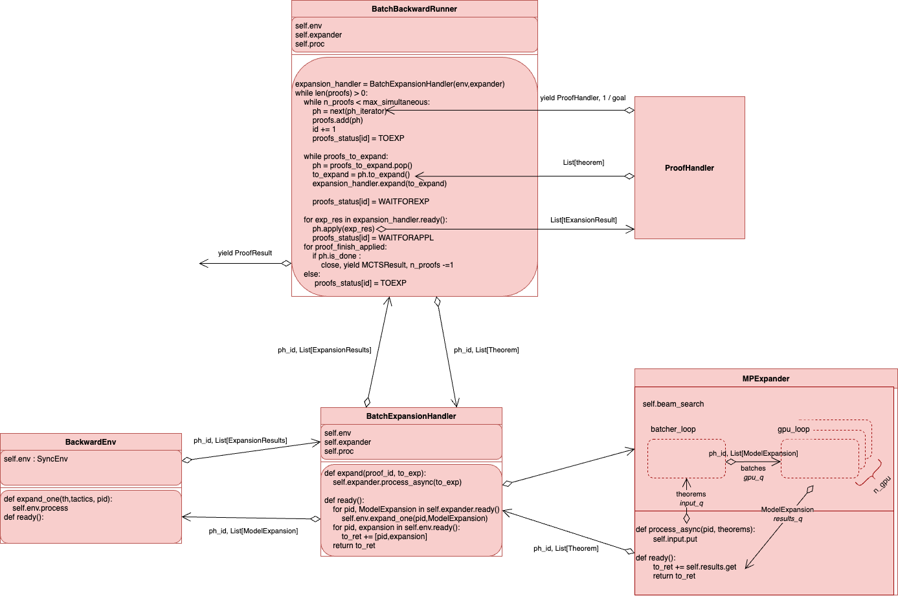
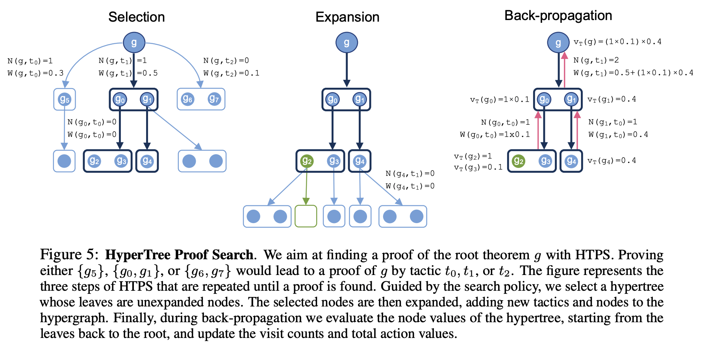

.. currentmodule:: evariste.backward.prover.prover

Backward Prover
===============

The backward prover interacts with several components asynchronously, represented below (click to zoom).

In particular :

* The :class:`BatchBackwardRunner` is responsible for stepping through proofs and communication between formal environments, proof handlers and models.
  It is the main entry point for proving and is used by `bwd_prove` in `simpler_run` for example.

* The :class:`BatchExpansionHandler` handles **expansions**. An expansion goes from *tactic_state* to a list of *(tactic, children)*. Precisely :
  
  * First a tactic state is sent to the model expander : `MPExpander`

  * Receive tactic suggestions, apply all of these in the formal env via `BackwardEnv` (and its `ExpanderEnv`)

  * For each tactic, receive children

* The :class:`ProofHandler` is responsible for selecting nodes to expand. It holds a representation of the proof search so far. A simple :class:`ProofHandler` is :class:`GreedyProofTreeHandler`. A more complex one is :class:`MCTSHandler`.

* The :class:`MPExpander` launches 2 processes, one for the batcher and one for the model

* The :class:`ExpanderEnv` can be synchronous or asynchronous depending on the formal env used.

.. note::

    :class:`AsyncProofStitcher` and :class:`AsyncProofCleaner` are only used for Lean.

.. warning::

    Due to the asynchronous nature of all these things, debugging can be difficult if things deadlock. All exceptions should crash the whole thing and be reported.
    
    However, proving could "hang" and stop making progress. In this case, it's likely that one or several :enum:`ProofStatus` aren't being updated, which indicates which component messed up.
    
    Reproducing this "hang" on a single simultaneous proof makes debugging much easier. 
    
    Some envs are asynchronous by default but can be used synchronously (`Equations`, `HOL`), which may make debugging easier.

Batch Backward Runner
---------------------

The main object to understand is the :enum:`ProofStatus` which indicates what the proof is waiting for to make progress.

.. autoenum:: ProofStatus
    :members:

:class:`BatchBackwardRunner` works like an :class:`AsyncWorker` so we only document the methods making progress on proof handlers:

.. autoclass:: BatchBackwardRunner
   :members:

The preferred way to use :class:`BatchBackwardRunner` is through :meth:`init_and_run_prover` which returns an iterator and makes sure everything is closed properly.

.. autofunction:: init_and_run_prover

Proof Handler
-------------

ProofHandler handles the proof search. It chooses nodes to expand, receives expansions from the environment. We give here the documentation for the abstract base class.

For concrete examples : :class:`GreedyProofTreeHandler` and :class:`MCTSHandler`.

.. autoclass:: ProofHandler
   :members:

BatchExpansionHandler
---------------------

BatchExpansionHandler communicates with both a :class:`BackwardEnv` and an :class:`MPExpander` to chain calls to both.

.. autoclass:: BatchExpansionHandler
    :members:

MP Expander
-----------

.. autoclass:: MPExpander
    :members:

Backward Env and Expander Env
-----------------------------

.. autoclass:: BackwardEnv
    :members:

.. currentmodule:: evariste.backward.env.core
.. autoclass:: ExpanderEnv
    :members:

HTPS
====

From the `paper <https://arxiv.org/abs/2205.11491>`_ (click to zoom):

.. currentmodule:: evariste.backward.prover

The main code for HTPS (but everything is called MCTS for historical reasons) proof search is located in `evariste/backward/prover/mcts.py`.
However, since finding the next nodes to expand might be slow, this is run in another process using several classes described below.

.. todo::
    There are too many indirections which could probably be simplified :
    :func:`mcts_prover.one_mcts_handler` instantiates an :class:`mcts_prover.MCTSRunner`, holding an :class:`mcts.MCTSHandler` which uses an :class:`mcts.MCTS`...
    
    Ideally we'd get rid of the two in the middle.

Proof Handlers
----------------------------------------------

.. currentmodule:: evariste.backward.prover.mcts_prover

A pool of processes is created by the :class:`MCTSProofHandlerGenerator`. Each process is attached to a :class:`MCTSProofHandler` which handles communication via input and output queues.

.. autoclass:: MCTSProofHandlerGenerator
    :members:

.. autoclass:: MCTSProofHandler
    :members:

:class:`MCTSProofHandler` provides communication with :func:`one_mcts_handler` which instantiates an :class:`MCTSRunner` and feed its main method: :meth:`MCTSRunner.do_proving`

.. autoclass:: MCTSRunner
    :members:

.. note::
    The most frequent cause of deadlock when changing the behaviour of the mcts_handler is to get into mismatched states between the :class:`BatchBackwardRunner` and the :class:`MCTSRunner`.
    In order to debug this, but avoid outputting too many logs, we use a `tail_logger` activated `via` ``prover_params.quiet``.
    
    A tail logger will log each state change from the :class:`MCTSRunner`, but logs will be rotated when they are too long.
    
    These logs are found in ``prover_dump_path / mcts_logs / one_mcts/.{process_id}.log``. A process local profiler can also be started if the ``PROFILE`` global variable is set to True.

.. currentmodule:: evariste.backward.prover.mcts

Finally, we reach the :class:`MCTSHandler`, last wrapper around the :class:`MCTS`.

.. autoclass:: MCTSHandler
    :members:

HTPS and Graph
--------------

.. currentmodule:: evariste.backward.prover

The :class:`mcts.MCTS` is backed by the :class:`graph.Graph` class which handles all graph book-keeping and computations.

.. currentmodule:: evariste.backward.prover.mcts
.. autoclass:: MCTS
    :members:

.. currentmodule:: evariste.backward.prover.graph

.. autoclass:: Graph
    :members:

Creating a new environment
==========================

Adding a new environment is relatively simple.

The environment in the PR is a simple environment, dubbed SR, that allows to use MCTS search to perform symbolic regression. SR leverages the `Node` structure from the existing `Equations` environment.
We show a summary of the all the files that have been added / modified to the codebase to support the new environment and its integration within the full MCTS pipeline.

Code structure (supervised training)
------------------------------------

SR Environment: `SREnv` and `SREnvArgs`
~~~~~~~~~~~~~~~~~~~~~~~~~~~~~~~~~~~~~~~

The code for the Symbolic Regression environment `SREnv`. Each environment is added to a folder ``formal/evariste/envs/ENV_NAME/``.
This contains the code to manipulate expressions / generate synthetic data, etc.
For a new formal system (e.g. Isabelle) you would mainly need to have an ``api.py`` that interfaces Python with the proving environment.
`SREnvArgs` contains the parameters of the environment `SREnv` (e.g. the allowed operators).

.. code-block:: console

    formal/evariste/envs/sr/__init__.py
    formal/evariste/envs/sr/env.py
    formal/evariste/envs/sr/generation.py
    formal/evariste/envs/sr/rules.py
    formal/evariste/envs/sr/tokenizer.py

Dataset configuration: `SRDatasetConf`
~~~~~~~~~~~~~~~~~~~~~~~~~~~~~~~~~~~~~~

Defines a small class `SRDatasetConf` to set the parameters of the dataset  (e.g. the size of expressions, generations, etc.) and pre-initialize a few named configurations.

.. code-block:: console

    formal/evariste/datasets/__init__.py
    formal/evariste/datasets/sr.py

`SRDatasetConf` is a bit redundant with `SREnvArgs`, and will contain things related to the data generation (which is independent of the environment itself).

Data environment: `SRDataEnvironment` / `SRArgs`
~~~~~~~~~~~~~~~~~~~~~~~~~~~~~~~~~~~~~~~~~~~~~~~~

`SRDataEnvironment` inherits `DataEnvironment` and contains the code that will fetch data from the environment / convert it to a format parsable by the model. `DataEnvironment` comes with efficient multi-processed data loaders. For an existing environment like Isabelle, the main thing to do here is would be to load existing data from the disk, create a train/valid/test split of theorems, and tokenize it.

.. code-block:: console

    formal/evariste/model/data/envs/builder.py
    formal/evariste/model/data/envs/sr.py
    formal/evariste/model/data/envs/sr_args.py

`SRArgs` contains `SRDatasetConf`, and optionally some other arguments specific to training.

Code structure (MCTS training)
------------------------------

Everything from the previous section is sufficient to start a training where data is generated on the fly, and fed to a trainer. Evaluation is done at the end of each epoch, with a simple exact match on the decoded tactics. In `formal/evariste/backward/`, we need to add a couple of things to interface the new environment with the MCTS:

.. code-block:: console

    formal/evariste/backward/dag_factory.py
    formal/evariste/backward/env/sr/__init__.py
    formal/evariste/backward/env/sr/env.py
    formal/evariste/backward/env/sr/graph.py
    formal/evariste/backward/goal_factory.py
    formal/evariste/backward/prover_factory.py

The two important files here are:

.. code-block:: console

    formal/evariste/backward/env/sr/env.py
    formal/evariste/backward/env/sr/graph.py

The other files essentially contain some tiny modifications to link to the new environment.

``formal/evariste/backward/env/sr/graph.py`` defines two objects: `SRTheorem` and `SRTactic` that respectively inherit from the generic `Theorem` and `Tactic` objects.
In `SRTactic` you will need to define a few functions, notably:

* `tokenize` that converts a tactic object to a list of tokens we can feed to the model

* `from_tokens` that convert tokens (generated by the decoder) to a tactic

In `SRTheorem` you will need to define the two same functions: `tokenize` so we can feed a model to the encoder, and `from_tokens` which is used for forward proving (actually not used in MCTS).

In ``formal/evariste/backward/env/sr/env.py``, you need to define a function `apply_bwd_tactic`. This is an essential function that takes as input a `SRTheorem` object, a `SRTactic` object, and applies the tactic to the theorem. It then returns a list of `SRTheorem` (which can be empty, if the tactic solves the goal).
You then need to define `SREnvWorker`, which inherits `EnvWorker`, a very generic class that essentially requires to define `apply_tactic`. In particular, `SREnvWorker.apply_tactic` simply calls `apply_bwd_tactic`.

And that's it. Everything is ready to start a full MCTS training!

Other minor edits
-----------------

Everything below are some trivial / minor things (but still important) and each change is only composed of very few lines.

.. code-block:: bash

    # just a few lines of changes to add the SR dataset conf to the list of training parameters
    formal/evariste/trainer/args.py

    # some file where we store all our models and gave them a name to retrieve them easily
    # and quickly start new experiments with them. in particular, we added some SR models
    formal/evariste/model_zoo.py

    # update our script that starts greedy / MCTS evaluations
    formal/scripts/gui/simpler_run.py

    # some debugging files
    formal/notebooks/sr/Equations.ipynb
    formal/scripts/gui/debug.py

    # update the requirements (in that case, we needed to install the SymPy library)
    formal/requirements.txt

    # some sweep files to train a model with the new env
    formal/sweeps/pak/train_sr.json
    formal/sweeps/pak/train_sr_polynomials.json

    # tell mypy to verify the correctness of the new env
    formal/mypy.ini

    # other unrelated minor changes specific to the Equations environment,
    # that were necessary to support the symbolic regression environment
    formal/evariste/model/data/envs/env.py
    formal/evariste/model/data/envs/equations.py
    formal/evariste/envs/eq/env.py
    formal/evariste/envs/eq/graph.py
    formal/evariste/envs/eq/lean_utils.py
    formal/evariste/envs/eq/rules_default.py
    formal/evariste/envs/eq/rules_lean.py
    formal/evariste/envs/eq/rules_lean_manual.py
    formal/evariste/envs/eq/rules_lib.py
    formal/evariste/envs/eq/sympy_utils.py
    formal/evariste/envs/eq/utils.py
    formal/evariste/model/data/dictionary.py
    formal/evariste/adversarial/prover.py
    formal/evariste/envs/lean/utils.py
    formal/evariste/datasets/equations.py