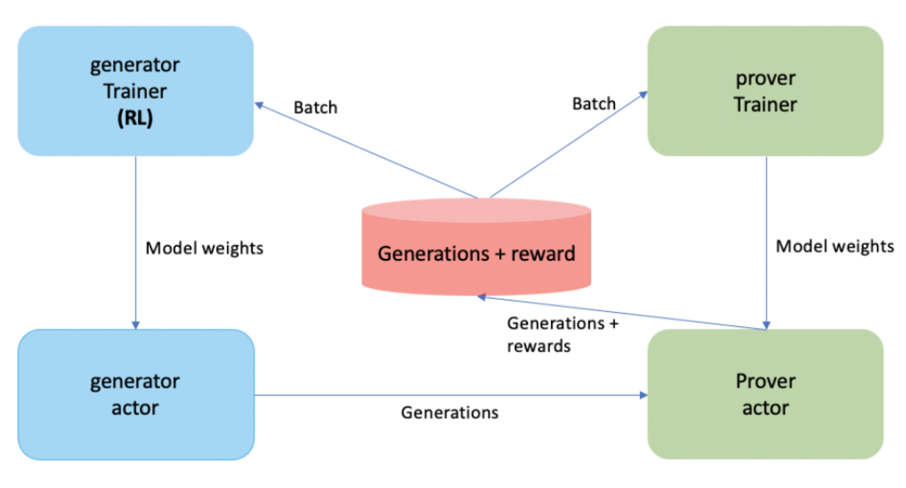

# Adversarial Training


## Description and setup

The goal is to train a generator and a prover jointly. The generator is trained to generate theorems (w/ their proof) that the prover can’t prove, and the prover is trained on the proofs generated by this generator.

We hope that this will allow us to improve the backward/forward prover.





## Logs, ressources, project tracking:

You can find pointers on this google doc: [Adversarial Training of Generator/Prover](https://docs.google.com/document/d/1YkDngGko-F4FvCmwu3jaVD_zKKe1P7g-0wSAwdEzeZQ/edit#https://docs.google.com/document/d/1YkDngGko-F4FvCmwu3jaVD_zKKe1P7g-0wSAwdEzeZQ/edit#)


## Launching a training

### Local debug training

You will need to launch 4 processes, one actor and trainer for the generator, and one actor and trainer for the prover.

```
python adversarial_train.py --cfg mm_adv_fwd_debug_local --overwrite_slurm_rank 0 --exp_id my_exp_id
```

```
python adversarial_train.py --cfg mm_adv_fwd_debug_local --overwrite_slurm_rank 1 --exp_id my_exp_id
```

```
CUDA_VISIBLE_DEVICES=1 python adversarial_train.py --cfg mm_adv_fwd_debug_local --overwrite_slurm_rank 2 --exp_id my_exp_id
```

```
CUDA_VISIBLE_DEVICES=1 python adversarial_train.py --cfg mm_adv_fwd_debug_local --overwrite_slurm_rank 3 --exp_id my_exp_id
```


Here the world_size is hardcoded to 4, the type of worker (actor or trainer, generator or prover) is determined by `overwrite_slurm_rank` locally (and given by slurm rank on slurm jobs).

You need to be sure that the 4 workers are using the same `exp_id`, and to update it between runs if you want to start an experiment from a clean state.


## Details on the config

The config is mainly: 

- a TrainerArgs for the prover
- a TrainerArgs for the generator
- num_prover_actors, num_prover_trainers, num_generator_actors, num_generator_trainers. Beware the sum of the 4 needs to be equal to your world size.

You can have a look at the function `default_mm_adv_fwd_cfg` in ``configs/adv_configs.py`` to see how configs are built.


## Pointers to the code

- Launching script: `adversarial_train.py`: all the logic on how to create the workers configs and run them is there.

- Trainer worker is the same code than the one launched in `train.py`

- Actor worker code is in `evariste/generation/cli/rl_generation_worker.py`

- Communicaton between workers are handled by ZMQ or zip fles on the NFS. Implementations are here: `evariste/generation/replay_buffer`


